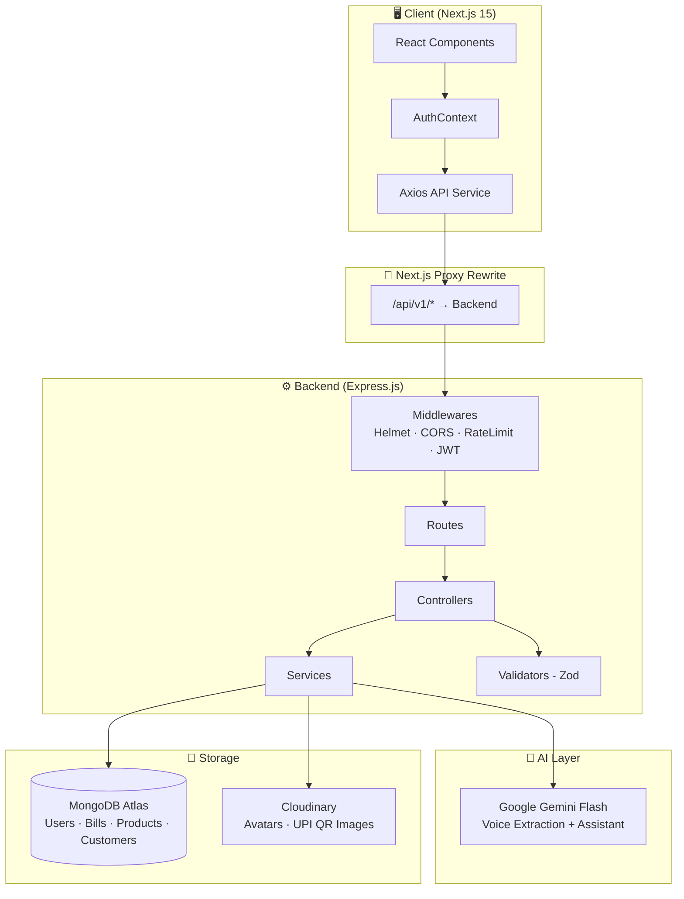

<div align="center">

# 🛒 Dukaan Saathi

### *AI-Powered Billing & Business Intelligence Platform for Local Indian Shops*

**Speak in Bengali, Hindi, or English — let AI do the billing.**

Voice-driven bill generation · Real-time analytics · AI business advisor · Multi-language support

</div>

<div align="center">

[](https://nodejs.org)
[](https://expressjs.com)
[](https://nextjs.org)
[](https://mongodb.com)
[](https://aistudio.google.com)
[](https://cloudinary.com)
[](https://tailwindcss.com)
[](https://render.com)
[](LICENSE)

</div>

<p align="center">
  <a href="https://dukaansathi-ai.vercel.app/">🚀 Live Demo</a> ·
  <a href="#-api-documentation">📖 API Documentation</a> ·
  <a href="#-getting-started">⚡ Getting Started</a> ·
  <a href="#-contributing">🤝 Contributing</a>
</p>

---

## 📌 Overview

**Dukaan Saathi** (दुकान साथी · দোকান সাথী — *"Shop Companion"*) is a full-stack AI-powered billing and business intelligence platform built for **local Indian small businesses** — grocery stores, pharmacies, electronics shops, clothing stores, and more.

It replaces manual paper billing with an **AI voice-to-bill pipeline** powered by **Google Gemini**, so shop owners can simply speak the customer's purchase in **Bengali, Hindi, or English** and have a structured bill generated in seconds — no typing, no training, no English-only software.

Beyond billing, Dukaan Saathi delivers a **real-time analytics dashboard**, **customer management**, **product inventory tracking**, and an **AI business advisor** that answers natural-language questions about the shop's performance using real database numbers.

---

## ❓ Problem Statement

| Challenge | Impact |
|---|---|
| Manual paper billing is slow and error-prone | Lost revenue, customer dissatisfaction |
| No visibility into business performance | Poor inventory and financial decisions |
| Language barriers with English-only software | Low adoption of technology |
| No time for complex software training | Owners stick to outdated methods |
| Cash vs UPI tracking is manual | Inaccurate financial records |

---

## 💡 Solution

Dukaan Saathi solves these problems with a **three-pillar approach**:

1. **🎙️ Voice AI Billing** — Speak naturally in Bengali/Hindi/English. Gemini extracts items, quantities, and prices and auto-generates a structured bill in seconds.
2. **📊 Analytics Dashboard** — Visual charts for daily/weekly/monthly revenue trends, top-selling products, customer reports, and payment-mode breakdowns.
3. **🤖 AI Business Advisor** — Ask *"What's my best seller this month?"* and get instant, AI-narrated answers computed from your own shop data.

---

## ✨ Key Features

| Feature | Description |
|---|---|
| 🎙️ **Voice-to-Bill AI** | Speak purchases in Bengali, Hindi, or English — Gemini extracts every item, quantity, unit, and price automatically |
| ⚡ **Recent Billed Items** | One-tap re-billing: recent products with last price, unit, and billing time; quantity steppers and instant add to the current bill |
| 🧾 **Smart Billing** | Catalog matching with saved prices, ambiguous-product resolution, and automatic learning of new products |
| 📊 **Real-Time Dashboard** | Area charts for revenue trends, horizontal bar charts for top products, live summary cards |
| 🤖 **AI Business Advisor** | Intent-detection engine routes questions to targeted MongoDB aggregations, then Gemini narrates the answer |
| 👥 **Customer Management** | Track customers by phone number, view purchase history, total spend, and bill count |
| 📦 **Product Inventory** | Product catalogue with name, price, unit, stock levels, categories, and tax rates |
| 🖼️ **Profile Pictures & UPI QR** | Upload a profile avatar with live preview and a shop UPI QR code (Cloudinary) for bills |
| 💳 **Payment Tracking** | Track Cash vs UPI payments; mark bills as paid or pending |
| 🔁 **Silent Token Refresh** | Axios interceptor transparently refreshes access tokens via httpOnly cookie |
| 🌙 **Dark / Light Mode** | Full system-level theme switching with next-themes and CSS custom properties |
| 🌐 **Multi-Language Support** | Preferred language (Bengali, Hindi, English) stored per user profile |

---

## 🖼️ Screenshots

> _Screenshots coming soon. Drop your app captures in `docs/screenshots/` and reference them here._

| Dashboard | Voice Billing | AI Advisor |
|---|---|---|
| `docs/screenshots/dashboard.png` | `docs/screenshots/billing.png` | `docs/screenshots/advisor.png` |

---

## 🏗️ Architecture



### 🗂️ Repository Structure

```
Dukaan_Sathi/
├── Backend/                     # Express.js REST API (ESM)
│   ├── src/
│   │   ├── app.js               # Express app, middleware registration
│   │   ├── index.js             # Server entry point
│   │   ├── config/              # Env config + validation, Cloudinary SDK
│   │   ├── controllers/         # Route handlers (auth, billing, products, …)
│   │   ├── models/              # Mongoose models (User, Bill, Product, Customer)
│   │   ├── routes/              # /api/v1/* route definitions
│   │   ├── middlewares/         # JWT, upload, rate limit, request tracing
│   │   ├── services/            # Gemini, analytics, billing, cloudinary, smart billing
│   │   ├── validators/          # Zod schemas
│   │   ├── helpers/             # Bill numbers, stats, auto-add products
│   │   └── utils/               # ApiError/ApiResponse, asyncHandler, logger
│   ├── tests/                   # Node test runner + supertest integration tests
│   ├── artillery.yml            # Load-testing config
│   └── render.yaml              # Render.com deployment config
│
├── Frontend/                    # Next.js 15 App Router
│   ├── src/
│   │   ├── app/                 # Pages (dashboard, billing, bills, products, …)
│   │   ├── components/          # layout/, billing/, modals/, ui/ components
│   │   ├── context/             # AuthContext (auth state + route guards)
│   │   ├── services/            # Axios instance + silent-refresh interceptor
│   │   ├── constants/           # Navigation, languages, categories
│   │   └── utils/               # Animations, time formatting
│   ├── tests/                   # Vitest + React Testing Library
│   └── next.config.mjs          # API proxy rewrites to backend
│
└── README.md
```

---

## 🛠️ Technology Stack

### Backend

| Category | Technology | Purpose |
|---|---|---|
| Runtime | Node.js ≥ 18 (ESM) | Server runtime |
| Framework | Express 4 | REST API framework |
| Database | MongoDB Atlas + Mongoose 8 | Storage + ODM |
| AI | Google Gemini Flash | Voice extraction + advisor |
| Auth | jsonwebtoken + bcrypt | Dual-token auth, hashed secrets |
| Security | Helmet · CORS · express-rate-limit | HTTP hardening |
| Validation | Zod | Schema validation |
| Media | Cloudinary + Multer | Avatar & QR uploads |
| Testing | Node test runner + supertest | Unit & integration tests |
| Load testing | Artillery | Performance benchmarks |

### Frontend

| Category | Technology | Purpose |
|---|---|---|
| Framework | Next.js 15 (App Router) + React 18 | SSR + routing |
| Styling | Tailwind CSS v4 | Utility-first design system |
| Charts | Recharts | Area/bar charts |
| Animations | Framer Motion | Page & micro-animations |
| HTTP | Axios | API calls + interceptors |
| Theme | next-themes | Dark/light mode |
| Testing | Vitest + React Testing Library | Component tests |

---

## ⚡ Getting Started

### Prerequisites

```bash
node --version   # >= 18.0.0
npm --version    # >= 9.0.0
```

You will also need:

- **MongoDB Atlas** cluster URI — [sign up](https://mongodb.com/atlas)
- **Google Gemini API Key** — [get one free](https://aistudio.google.com/apikey)
- **Cloudinary account** — [sign up](https://cloudinary.com)

### 1. Clone the repository

```bash
git clone https://github.com/R4NiTeXe/Dukaan_Sathi.git
cd Dukaan_Sathi
```

### 2. Run the backend

```bash
cd Backend
npm install
cp .env.example .env      # then fill in your credentials
npm run dev               # → http://localhost:8000
```

### 3. Run the frontend

```bash
cd ../Frontend
npm install
cp .env.example .env.local
npm run dev               # → http://localhost:3000
```

### 4. Verify

```bash
curl http://localhost:8000/health
```

```json
{
  "status": "ok",
  "database": "connected",
  "services": { "gemini": "ok", "cloudinary": "ok" }
}
```

> The Next.js dev proxy forwards `/api/v1/*` to the backend, so no CORS setup is needed locally.

---

## ⚙️ Environment Variables

### Backend (`Backend/.env`)

| Variable | Required | Default | Description |
|---|---|---|---|
| `PORT` | ❌ | `8000` | Server port |
| `MONGODB_URI` | ✅ | — | MongoDB connection string |
| `DB_NAME` | ❌ | `ai-billing` | Database name |
| `JWT_SECRET` | ✅ | — | Access token secret (min 16 chars) |
| `JWT_REFRESH_SECRET` | ❌ | `JWT_SECRET` | Refresh token secret |
| `JWT_EXPIRY` | ❌ | `7d` | Access token lifetime |
| `JWT_REFRESH_EXPIRY` | ❌ | `30d` | Refresh token lifetime |
| `GEMINI_API_KEY` | ✅ | — | Google Gemini API key |
| `GEMINI_MODEL` | ❌ | `gemini-flash-latest` | Gemini model |
| `CLOUDINARY_CLOUD_NAME` | ✅ | — | Cloudinary cloud name |
| `CLOUDINARY_API_KEY` | ✅ | — | Cloudinary API key |
| `CLOUDINARY_API_SECRET` | ✅ | — | Cloudinary API secret |
| `RATE_LIMIT_MAX` | ❌ | `300` | Requests per 15 min per IP |
| `CORS_ORIGIN` | ❌ | `*` | Allowed origins (comma-separated) |

### Frontend (`Frontend/.env.local`)

| Variable | Required | Default | Description |
|---|---|---|---|
| `NEXT_PUBLIC_API_URL` | ❌ | `/api/v1` | API base URL (uses Next.js proxy) |
| `BACKEND_API_URL` | ✅ (prod) | `http://localhost:8000` | Backend origin for proxy rewrites |

---

## 🔌 API Documentation

**Base URL:** `https://ai-billing-backend.onrender.com/api/v1` — all protected endpoints require `Authorization: Bearer <accessToken>`.

### Auth — `/api/v1/auth`

| Method | Endpoint | Auth | Description |
|---|---|---|---|
| `POST` | `/register` | ❌ | Register a shop owner |
| `POST` | `/login` | ❌ | Login (sets httpOnly refresh cookie) |
| `POST` | `/refresh` | Cookie | Silent token refresh |
| `POST` | `/logout` | ❌ | Clear refresh token |
| `GET` | `/profile` | ✅ | Get profile |
| `PUT` | `/profile` | ✅ | Update profile + upload avatar / UPI QR (`multipart/form-data`) |

### Billing — `/api/v1/billing`

| Method | Endpoint | Auth | Description |
|---|---|---|---|
| `POST` | `/extract` | ✅ | Voice transcript → extracted items |
| `POST` | `/save` | ✅ | Save a validated bill |
| `GET` | `/recent-products` | ✅ | Recently billed products (name, unit price, last billed at) |

### Bills / Customers / Products

| Method | Endpoint | Auth | Description |
|---|---|---|---|
| `GET` / `GET :id` / `DELETE :id` | `/api/v1/bills` | ✅ | List (paginated) / view / delete bills |
| `GET` / `POST` / `DELETE :id` | `/api/v1/customers` | ✅ | Customer management |
| `GET` / `POST` / `PUT :id` / `DELETE :id` | `/api/v1/products` | ✅ | Product inventory |
| `GET` | `/api/v1/products/search?q=` | ✅ | Typo-tolerant catalog search |

### Analytics / Dashboard / Assistant

| Method | Endpoint | Auth | Description |
|---|---|---|---|
| `GET` | `/api/v1/analytics/monthly` | ✅ | Revenue by month (last 6) |
| `GET` | `/api/v1/analytics/weekly` | ✅ | Revenue by day (last 7) |
| `GET` | `/api/v1/analytics/top-products` | ✅ | Top products by revenue |
| `GET` | `/api/v1/analytics/customer-report` | ✅ | Customer spending report |
| `GET` | `/api/v1/dashboard/summary` | ✅ | Dashboard summary |
| `POST` | `/api/v1/assistant/ask` | ✅ | Ask the AI advisor |

### Health / Metrics

| Method | Endpoint | Auth | Description |
|---|---|---|---|
| `GET` | `/health` | ❌ | Server, DB, Gemini, Cloudinary status |
| `GET` | `/metrics` | ❌ | Request count & latency metrics |

### Example: extract items from voice

```bash
curl -X POST http://localhost:8000/api/v1/billing/extract \
  -H "Authorization: Bearer <accessToken>" \
  -H "Content-Type: application/json" \
  -d '{"transcript": "2 kg chaal, 1 liter dudh, aur 500 gram chini"}'
```

```json
{
  "success": true,
  "data": {
    "items": [
      { "productName": "Rice", "quantity": 2, "unit": "kg", "price": 0 },
      { "productName": "Milk", "quantity": 1, "unit": "liter", "price": 0 },
      { "productName": "Sugar", "quantity": 500, "unit": "gram", "price": 0 }
    ]
  }
}
```

### Example: fetch recent billed items

```bash
curl http://localhost:8000/api/v1/billing/recent-products?limit=10 \
  -H "Authorization: Bearer <accessToken>"
```

```json
{
  "success": true,
  "data": {
    "products": [
      { "productName": "Rice", "unit": "kg", "unitPrice": 100, "lastBilledAt": "2026-08-07T12:00:00.000Z" }
    ]
  }
}
```

---

## 🔐 Authentication & Security

- **Dual-token JWT** — short-lived access token (7d, localStorage) + long-lived refresh token (30d, **httpOnly cookie**, bcrypt-hashed in DB).
- **Silent refresh** — the Axios interceptor exchanges the refresh cookie for a new access token and retries the request; concurrent 401s share one refresh call.
- **Brute-force protection** — in-memory throttle locks an `IP + email` pair for 15 minutes after 5 failed logins.
- **Input validation** — every endpoint is validated with Zod.
- **Security headers** — Helmet, configurable CORS allowlist, global rate limiting (300 req / 15 min).
- **Request tracing** — every request gets a UUID; slow MongoDB queries are logged.

---

## 🧪 Testing

### Backend

```bash
cd Backend
npm test              # lint + all tests (Node test runner + supertest)
npm run test:watch    # watch mode
npx artillery run artillery.yml   # load tests
```

| File | Coverage |
|---|---|
| `auth.test.mjs` | Register, login, refresh, logout, profile |
| `core.test.mjs` | Billing, bills, products, analytics, dashboard |
| `assistant.test.mjs` | AI advisor intent detection (mocked) |
| `recent.test.mjs` | Recent-products endpoint, avatar profile updates |
| `smartbilling.test.mjs` / `autoAdd.test.mjs` | Catalog learning & auto-add |
| `edge.test.mjs` / `login.test.mjs` / `health.test.mjs` | Validation, throttling, health |

### Frontend

```bash
cd Frontend
npm test    # Vitest + React Testing Library
```

---

## ☁️ Deployment

The repo ships with `render.yaml` for one-click Render.com deployment of **both services**:

```yaml
# ai-billing-backend  → Node.js, port 8000
# ai-billing-frontend → Next.js, port 3000
```

1. Connect the GitHub repo to Render.
2. Choose **Infrastructure as Code** (`render.yaml`).
3. Set the secrets listed in [Environment Variables](#️-environment-variables) in the Render dashboard.

Manual production build:

```bash
# Backend
cd Backend && NODE_ENV=production npm start

# Frontend
cd Frontend && BACKEND_API_URL=https://your-backend.onrender.com npm run build && npm start
```

---

## 🗺️ Roadmap

| Status | Feature |
|---|---|
| ✅ | Voice-to-bill AI (Bengali/Hindi/English) |
| ✅ | Dual-token auth with brute-force protection |
| ✅ | Real-time dashboard with Recharts |
| ✅ | AI business advisor with intent detection |
| ✅ | Recent-billed quick-pick with quantity controls |
| ✅ | Profile avatars, UPI QR upload, dark/light mode |
| 🔄 | Bill PDF generation & thermal printer support |
| 🔄 | WhatsApp bill sharing |
| 🔄 | Offline mode with service workers |
| 🔄 | Multi-shop / employee accounts |
| 🔄 | GST calculation & compliance |
| 🔄 | Automated email reports |

---

## 🤝 Contributing

Contributions are very welcome! Follow these steps:

```bash
# 1. Fork the repository and clone your fork
git clone https://github.com/<your-username>/Dukaan_Sathi.git
cd Dukaan_Sathi

# 2. Create a feature branch
git checkout -b feature/your-feature-name

# 3. Make your changes, then lint + test
cd Backend && npm run lint && npm test
cd ../Frontend && npm test

# 4. Commit with a clear message
git commit -m "feat: add your feature description"

# 5. Push and open a Pull Request
git push origin feature/your-feature-name
```

### Code style

- **Backend:** ESLint + Prettier (`npm run lint`, `npm run format`), ESM modules, all async handlers wrapped in `asyncHandler`, consistent `ApiError` / `ApiResponse`.
- **Frontend:** `eslint-config-next`, CSS custom property tokens from `globals.css` (no hardcoded colors), all API calls through `src/services/api.js`, auth state exclusively via `AuthContext`.

---

## 🙋 FAQ

<details>
<summary><b>What languages does voice billing support?</b></summary>

Bengali, Hindi, and English. The Gemini prompt translates item names to English (e.g. *chaal → Rice*, *dudh → Milk*).
</details>

<details>
<summary><b>How does the AI advisor avoid hallucinating?</b></summary>

The assistant controller detects the intent of the question, runs the appropriate MongoDB aggregation, and passes only real numbers from your database to Gemini for narration.
</details>

<details>
<summary><b>Is the refresh token secure?</b></summary>

Yes — it is stored in an `httpOnly` cookie (inaccessible to JavaScript) and bcrypt-hashed in the database before storage.
</details>

<details>
<summary><b>Can I use a different database?</b></summary>

The backend is coupled to MongoDB via Mongoose and MongoDB-specific aggregations; switching would require reworking models and analytics services.
</details>

---

## 📄 License

This project is licensed under the **MIT License** — see the [LICENSE](LICENSE) file for details.

---

## 👤 Authors

| | |
|---|---|
| **R4NiTeXe** | [GitHub](https://github.com/R4NiTeXe) |
| **Pritam Maji** | [GitHub](https://github.com/pritamroman07-droid) |

---

## 🙏 Acknowledgements

- [Google Gemini](https://aistudio.google.com) · [MongoDB Atlas](https://mongodb.com/atlas) · [Cloudinary](https://cloudinary.com) · [Render](https://render.com)
- [Next.js](https://nextjs.org) · [Recharts](https://recharts.org) · [Framer Motion](https://www.framer.com/motion/) · [Lucide](https://lucide.dev)

---

<div align="center">

**⭐ If Dukaan Saathi helps your project, give it a star!**

*Built with ❤️ for Indian small businesses*

</div>
