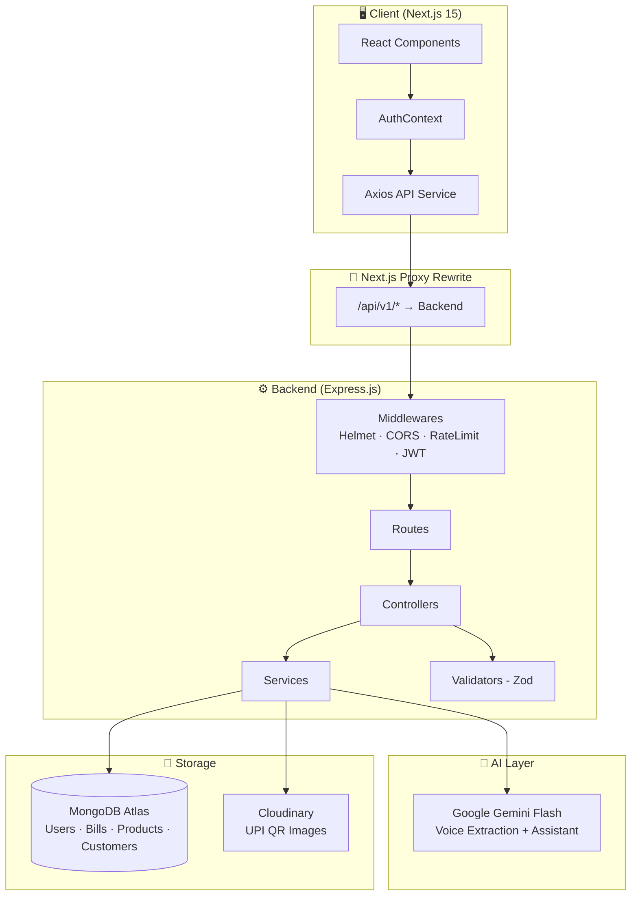
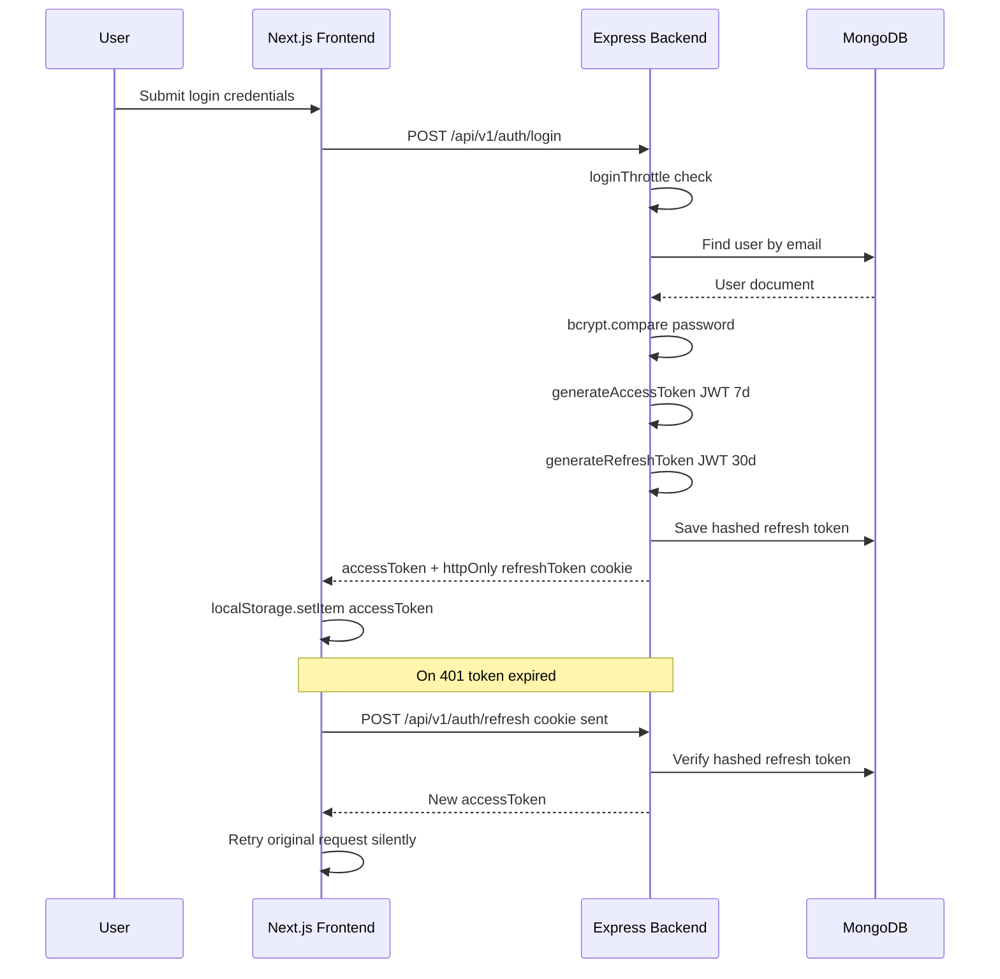
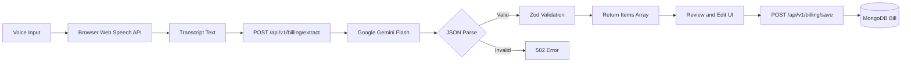
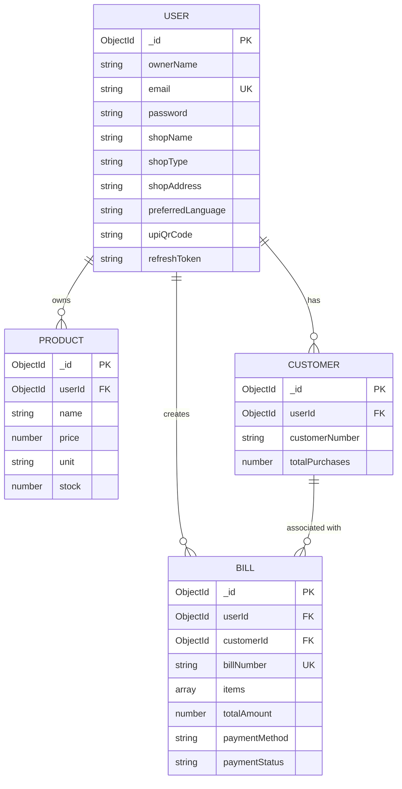
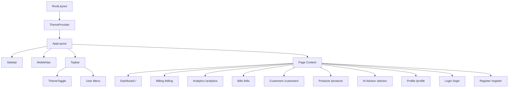
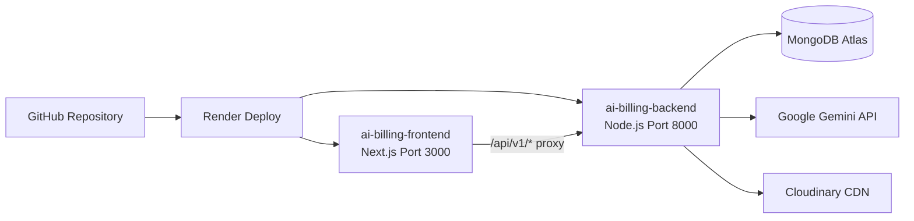

<div align="center">

<br />

# 🛒 Dukaan Saathi

### *AI-Powered Billing & Business Intelligence Platform for Local Indian Shops*

<p align="center">
  <b>Speak in Bengali, Hindi, or English — let AI do the billing.</b><br/>
  Voice-driven bill generation · Real-time analytics · AI business advisor · Multi-language support
</p>

<br/>

[](https://nodejs.org)
[](https://nextjs.org)
[](https://mongodb.com)
[](https://aistudio.google.com)
[](https://cloudinary.com)
[](https://render.com)
[](LICENSE)

<br/>

[🚀 Live Demo](https://dukaansathi-ai.vercel.app/) · [📖 API Docs](#-api-documentation) · [🐛 Report Bug](https://github.com/R4NiTeXe/AI-Billing/issues) · [💡 Request Feature](https://github.com/R4NiTeXe/AI-Billing/issues)

<br/>

---

</div>

## 📋 Table of Contents

- [📌 Overview](#-overview)
- [❓ Problem Statement](#-problem-statement)
- [💡 Solution](#-solution)
- [✨ Key Features](#-key-features)
- [🏗️ Architecture](#️-architecture)
- [🗂️ Folder Structure](#️-folder-structure)
- [🛠️ Technology Stack](#️-technology-stack)
- [🗄️ Database Schema](#️-database-schema)
- [🔌 API Documentation](#-api-documentation)
- [🔐 Authentication Flow](#-authentication-flow)
- [🚀 Quick Start](#-quick-start)
- [⚙️ Environment Variables](#️-environment-variables)
- [💻 Usage Examples](#-usage-examples)
- [🎨 UI/UX Design System](#-uiux-design-system)
- [🔒 Security Features](#-security-features)
- [🧪 Testing](#-testing)
- [☁️ Deployment](#️-deployment)
- [🗺️ Project Roadmap](#️-project-roadmap)
- [🤝 Contributing](#-contributing)
- [📄 License](#-license)
- [👤 Author](#-author)

---

## 📌 Overview

**Dukaan Saathi** (दुकान साथी · দোকান সাথী · *"Shop Companion"*) is a full-stack AI-powered billing and business intelligence platform designed specifically for **local Indian small businesses** — grocery stores, pharmacies, electronics shops, clothing stores, and more.

It replaces manual paper billing with an **AI voice-to-bill pipeline** powered by **Google Gemini**, enabling shop owners to simply **speak the customer's purchase in Bengali, Hindi, or English**, and have the bill generated instantly.

Beyond billing, it provides a **real-time analytics dashboard**, **customer management**, **product inventory tracking**, and an **AI business advisor** that answers natural language questions about the shop's performance.

---

## ❓ Problem Statement

Small shop owners in India face several daily operational challenges:

| Challenge | Impact |
|-----------|--------|
| Manual paper billing is slow and error-prone | Lost revenue, customer dissatisfaction |
| No visibility into business performance | Poor inventory & financial decisions |
| Language barriers with English-only software | Low adoption of technology |
| No time for complex software training | Owners stick to outdated methods |
| Cash vs UPI tracking is manual | Inaccurate financial records |

---

## 💡 Solution

Dukaan Saathi solves these problems with a **three-pillar approach**:

1. **🎙️ Voice AI Billing** — Shop owners speak naturally in Bengali/Hindi/English. Gemini AI extracts items, quantities, and prices and auto-generates a structured bill in seconds.

2. **📊 Analytics Dashboard** — Visual charts showing daily/weekly/monthly revenue trends, top-selling products, customer reports, and payment mode breakdowns.

3. **🤖 AI Business Advisor** — Ask questions like *"What's my best seller this month?"* or *"How did last week compare to this week?"* and get instant AI-powered answers using your own shop data.

---

## ✨ Key Features

| Feature | Description |
|---------|-------------|
| 🎙️ **Voice-to-Bill AI** | Speak purchases in Bengali, Hindi, or English — Gemini extracts every item, quantity, unit, and price automatically |
| 📊 **Real-Time Dashboard** | Area charts for revenue trends, horizontal bar charts for top products, live summary cards |
| 🤖 **AI Business Advisor** | Intent-detection engine routes questions to targeted MongoDB aggregations, then Gemini narrates the answer |
| 👥 **Customer Management** | Track customers by phone number, view purchase history, total spend, and bill count |
| 📦 **Product Inventory** | Maintain a product catalogue with name, price, unit, and stock levels |
| 💳 **Payment Tracking** | Track Cash vs UPI payments; mark bills as paid or pending |
| 🌙 **Dark / Light Mode** | Full system-level theme switching with next-themes and CSS custom properties |
| 🔁 **Silent Token Refresh** | Axios interceptor transparently refreshes access tokens via httpOnly cookie |
| 🖼️ **UPI QR Code Upload** | Upload shop QR code to Cloudinary for display on bills |
| 🌐 **Multi-Language Support** | Preferred language setting (Bengali, Hindi, English) stored per user profile |

---

## 🏗️ Architecture

### System Architecture



### Authentication Flow



### AI Voice Billing Flow



### Database ER Diagram



### Component Tree



### Deployment Flow



---

## 🗂️ Folder Structure

```
AI-Billing/
├── Backend/                             # Express.js REST API
│   ├── src/
│   │   ├── app.js                       # Express app setup, middleware registration
│   │   ├── index.js                     # Server entry point
│   │   ├── constant.js                  # Shared constants
│   │   ├── config/
│   │   │   ├── index.js                 # Centralised config with env validation
│   │   │   └── cloudinary.config.js     # Cloudinary SDK setup
│   │   ├── controllers/
│   │   │   ├── auth.controller.js       # Register, login, refresh, logout, profile
│   │   │   ├── billing.controller.js    # Voice extract + save bill
│   │   │   ├── bill.controller.js       # Bills CRUD
│   │   │   ├── customer.controller.js   # Customer management
│   │   │   ├── product.controller.js    # Product inventory
│   │   │   ├── analytics.controller.js  # Monthly/weekly/top products/customers
│   │   │   ├── assistant.controller.js  # AI advisor with intent detection
│   │   │   └── dashboard.controller.js  # Dashboard summary
│   │   ├── models/
│   │   │   ├── User.model.js            # User + JWT + bcrypt methods
│   │   │   ├── Bill.model.js            # Bills with compound indexes
│   │   │   ├── Product.model.js         # Product catalogue
│   │   │   └── Customer.model.js        # Customer records
│   │   ├── routes/
│   │   │   ├── auth.route.js            # /api/v1/auth
│   │   │   ├── billing.route.js         # /api/v1/billing
│   │   │   ├── bills.route.js           # /api/v1/bills
│   │   │   ├── customers.route.js       # /api/v1/customers
│   │   │   ├── products.route.js        # /api/v1/products
│   │   │   ├── analytics.route.js       # /api/v1/analytics
│   │   │   ├── assistant.route.js       # /api/v1/assistant
│   │   │   └── dashboard.route.js       # /api/v1/dashboard
│   │   ├── middlewares/
│   │   │   ├── auth.middleware.js        # JWT Bearer token verification
│   │   │   ├── error.middleware.js       # Global error handler + 404
│   │   │   ├── loginThrottle.middleware.js # In-memory brute-force protection
│   │   │   ├── metrics.middleware.js     # Request count/latency metrics
│   │   │   ├── requestId.middleware.js   # UUID request tracing
│   │   │   └── upload.middleware.js      # Multer + Cloudinary upload
│   │   ├── services/
│   │   │   ├── gemini.service.js         # Gemini AI: extractBillItems + askAssistant
│   │   │   ├── analytics.service.js      # MongoDB aggregation pipelines
│   │   │   ├── billing.service.js        # Bill save with customer update
│   │   │   └── cloudinary.service.js     # Cloudinary upload/delete
│   │   ├── validators/
│   │   │   ├── auth.validator.js         # Zod schemas for auth
│   │   │   ├── billing.validator.js      # Zod schemas for bill data
│   │   │   └── product.validator.js      # Zod schemas for products
│   │   ├── helpers/
│   │   │   ├── billNumber.helper.js      # Auto bill number generation
│   │   │   ├── customerNumber.helper.js  # Customer number generation
│   │   │   ├── customerStats.helper.js   # Customer aggregation helper
│   │   │   └── stats.helper.js           # Reusable aggregation builders
│   │   ├── utils/
│   │   │   ├── ApiError.js               # Standardised API error class
│   │   │   ├── ApiResponse.js            # Standardised API response class
│   │   │   ├── asyncHandler.js           # Express async error wrapper
│   │   │   └── logger.js                 # Structured access logger
│   │   └── db/
│   │       └── slowQuery.js              # MongoDB slow query tracking
│   ├── tests/
│   │   ├── auth.test.mjs
│   │   ├── core.test.mjs
│   │   ├── assistant.test.mjs
│   │   ├── health.test.mjs
│   │   ├── edge.test.mjs
│   │   ├── login.test.mjs
│   │   ├── seed.test.mjs
│   │   └── load.test.mjs
│   ├── artillery.yml                     # Artillery load test config
│   ├── render.yaml                       # Render.com deployment config
│   └── package.json
│
├── Frontend/                             # Next.js 15 App Router
│   ├── src/
│   │   ├── app/
│   │   │   ├── layout.js                 # Root layout with ThemeProvider + Inter font
│   │   │   ├── globals.css               # Tailwind v4 theme tokens + CSS variables
│   │   │   ├── page.js                   # Dashboard (/)
│   │   │   ├── login/                    # Login page
│   │   │   ├── register/                 # Registration page
│   │   │   ├── billing/                  # Voice AI billing page
│   │   │   ├── bills/                    # Bills history & management
│   │   │   ├── customers/                # Customer management
│   │   │   ├── products/                 # Product inventory
│   │   │   ├── analytics/                # Charts & analytics
│   │   │   ├── advisor/                  # AI chat assistant
│   │   │   └── profile/                  # User profile & QR upload
│   │   ├── components/
│   │   │   ├── layout/
│   │   │   │   ├── AppLayout.jsx         # Main app shell
│   │   │   │   ├── Sidebar.jsx           # Desktop navigation
│   │   │   │   ├── MobileNav.jsx         # Mobile bottom navigation
│   │   │   │   ├── Topbar.jsx            # Header with user menu
│   │   │   │   └── ThemeToggle.jsx       # Dark/light mode toggle
│   │   │   └── modals/
│   │   │       └── Modal.jsx             # Reusable modal component
│   │   ├── context/
│   │   │   └── AuthContext.jsx           # Global auth state + route guards
│   │   ├── services/
│   │   │   └── api.js                    # Axios instance + token refresh interceptor
│   │   └── utils/
│   │       └── animations.js             # Framer Motion variants
│   ├── next.config.mjs                   # API proxy rewrites to backend
│   └── package.json
│
├── docs/
│   └── api/
│       └── backend.md                    # API endpoint reference
└── README.md
```

---

## 🛠️ Technology Stack

### Backend

| Category | Technology | Version | Purpose |
|----------|-----------|---------|---------|
| **Runtime** | Node.js | ≥ 18.0.0 | Server runtime (ESM modules) |
| **Framework** | Express.js | ^4.19.2 | REST API framework |
| **Database** | MongoDB + Mongoose | ^8.5.1 | NoSQL database + ODM |
| **AI** | Google Gemini Flash | ^0.14.1 | Voice extraction + business advisor |
| **Auth** | jsonwebtoken | ^9.0.2 | Access + refresh token auth |
| **Security** | bcrypt | ^6.0.0 | Password + refresh token hashing |
| **Security** | helmet | ^7.1.0 | HTTP security headers |
| **Security** | express-rate-limit | ^8.6.1 | Global API rate limiting |
| **Validation** | Zod | ^3.23.8 | Schema validation |
| **Media** | Cloudinary | ^2.2.0 | UPI QR image upload & CDN |
| **Upload** | Multer | ^2.2.0 | Multipart file handling |
| **Compression** | compression | ^1.8.1 | Gzip response compression |
| **Logging** | morgan | ^1.11.0 | HTTP access logs |
| **Dev** | nodemon | ^3.1.4 | Auto-restart on change |
| **Linting** | ESLint + Prettier | latest | Code quality |
| **Testing** | Node.js built-in test runner | built-in | Unit & integration tests |
| **Load Testing** | Artillery | ^2.0.0 | Performance benchmarking |

### Frontend

| Category | Technology | Version | Purpose |
|----------|-----------|---------|---------|
| **Framework** | Next.js | 15.0.0 | React SSR + App Router |
| **UI Library** | React | ^18.3.1 | Component-based UI |
| **Styling** | Tailwind CSS v4 | ^4.0.0 | Utility-first CSS |
| **Animations** | Framer Motion | ^11.3.19 | Page transitions + micro-animations |
| **Charts** | Recharts | ^2.12.7 | Area charts + bar charts |
| **Icons** | Lucide React | ^0.417.0 | Consistent icon set |
| **HTTP Client** | Axios | ^1.7.2 | API requests + interceptors |
| **Theme** | next-themes | ^0.4.6 | Dark/light mode |
| **Font** | Inter (Google Fonts) | — | Modern sans-serif typography |
| **Testing** | Vitest + React Testing Library | ^4.x | Component tests |

---

## 🗄️ Database Schema

### Indexes (Performance Optimised)

```javascript
// Bill — core query patterns
billSchema.index({ userId: 1, createdAt: -1 })    // Recent bills per user
billSchema.index({ userId: 1, paymentStatus: 1 }) // Unpaid bills per user
billSchema.index({ userId: 1, customerId: 1 })    // Customer bill history

// Product — lookup by name
productSchema.index({ userId: 1, name: 1 })

// Customer — lookup by number
customerSchema.index({ userId: 1, customerNumber: 1 })

// User — email is unique + indexed
```

### Bill Items Sub-document

```javascript
items: [{
  productName: String,   // "Rice", "Sugar", "Milk"
  quantity:    Number,   // 2
  unit:        String,   // "kg", "piece", "liter"
  price:       Number    // Total price for that line in INR
}]
```

### Shop Types (Enum)

```
grocery | stationery | pharmacy | electronics | clothing | other
```

### Preferred Languages (Enum)

```
bn (Bengali) | hi (Hindi) | en (English)
```

---

## 🔌 API Documentation

**Base URL:** `https://ai-billing-backend.onrender.com/api/v1`

> All protected endpoints require `Authorization: Bearer <accessToken>` header.

### Auth — `/api/v1/auth`

| Method | Endpoint | Auth | Description |
|--------|----------|------|-------------|
| `POST` | `/register` | ❌ | Register a new shop owner |
| `POST` | `/login` | ❌ | Login — returns accessToken + sets cookie |
| `POST` | `/refresh` | Cookie | Silent access token refresh |
| `POST` | `/logout` | ❌ | Clear refresh token cookie |
| `GET` | `/profile` | ✅ | Get current user profile |
| `PUT` | `/profile` | ✅ | Update profile + UPI QR image upload |

### AI Billing — `/api/v1/billing`

| Method | Endpoint | Auth | Description |
|--------|----------|------|-------------|
| `POST` | `/extract` | ✅ | Send voice transcript → get extracted items |
| `POST` | `/save` | ✅ | Save validated bill to database |

### Bills — `/api/v1/bills`

| Method | Endpoint | Auth | Description |
|--------|----------|------|-------------|
| `GET` | `/` | ✅ | List all bills (paginated) |
| `GET` | `/:id` | ✅ | Get single bill by ID |
| `DELETE` | `/:id` | ✅ | Delete a bill |

### Customers — `/api/v1/customers`

| Method | Endpoint | Auth | Description |
|--------|----------|------|-------------|
| `GET` | `/` | ✅ | List all customers |
| `POST` | `/` | ✅ | Create a new customer |
| `DELETE` | `/:id` | ✅ | Delete a customer |

### Products — `/api/v1/products`

| Method | Endpoint | Auth | Description |
|--------|----------|------|-------------|
| `GET` | `/` | ✅ | List all products |
| `POST` | `/` | ✅ | Add a product |
| `PUT` | `/:id` | ✅ | Update product |
| `DELETE` | `/:id` | ✅ | Delete product |

### Analytics — `/api/v1/analytics`

| Method | Endpoint | Auth | Description |
|--------|----------|------|-------------|
| `GET` | `/monthly` | ✅ | Revenue by month (last 6 months) |
| `GET` | `/weekly` | ✅ | Revenue by day (last 7 days) |
| `GET` | `/top-products` | ✅ | Top products by revenue |
| `GET` | `/customer-report` | ✅ | Customer spending report |

### AI Assistant — `/api/v1/assistant`

| Method | Endpoint | Auth | Description |
|--------|----------|------|-------------|
| `POST` | `/ask` | ✅ | Ask business questions in natural language |

### Dashboard — `/api/v1/dashboard`

| Method | Endpoint | Auth | Description |
|--------|----------|------|-------------|
| `GET` | `/summary` | ✅ | Full dashboard summary aggregation |

### Health & Metrics

| Method | Endpoint | Auth | Description |
|--------|----------|------|-------------|
| `GET` | `/health` | ❌ | Server, DB, Gemini, Cloudinary status |
| `GET` | `/metrics` | ❌ | Request count & latency metrics |

---

## 🔐 Authentication Flow

Dukaan Saathi uses a **dual-token authentication** system:

```
┌─────────────────────────────────────────────────────────────┐
│  ACCESS TOKEN (JWT)          │  REFRESH TOKEN (JWT)         │
│  Lifetime: 7 days            │  Lifetime: 30 days           │
│  Storage: localStorage       │  Storage: httpOnly cookie    │
│  Sent: Authorization header  │  Sent: automatically         │
│  Purpose: API auth           │  Purpose: silent renewal     │
└─────────────────────────────────────────────────────────────┘
```

**Brute-Force Protection:**
- In-memory login throttle per `IP + email` pair
- Locks for 15 minutes after 5 failed attempts
- Self-sweeping Map to prevent memory leaks

**Silent Token Refresh:**
- Axios response interceptor catches `401` responses
- Single shared `refreshPromise` prevents concurrent refresh races
- Automatically retries the original failed request transparently

---

## 🚀 Quick Start

### Prerequisites

```bash
node --version   # >= 18.0.0
npm --version    # >= 9.0.0
```

You also need:
- **MongoDB Atlas** cluster URI
- **Google Gemini API Key** — [Get one here](https://aistudio.google.com/apikey)
- **Cloudinary account** — [Sign up here](https://cloudinary.com)

### 1. Clone the Repository

```bash
git clone https://github.com/R4NiTeXe/AI-Billing.git
cd AI-Billing
```

### 2. Set Up the Backend

```bash
cd Backend
npm install

# Configure environment
cp .env.example .env
# Edit .env with your credentials

# Start development server
npm run dev
# → http://localhost:8000
```

### 3. Set Up the Frontend

```bash
cd ../Frontend
npm install

# Configure environment
cp .env.example .env.local

# Start development server
npm run dev
# → http://localhost:3000
```

### 4. Verify the Setup

```bash
curl http://localhost:8000/health
```

```json
{
  "status": "ok",
  "database": "connected",
  "services": { "gemini": "ok", "cloudinary": "ok" }
}
```

---

## ⚙️ Environment Variables

### Backend (`Backend/.env`)

| Variable | Required | Default | Description |
|----------|----------|---------|-------------|
| `PORT` | ❌ | `8000` | Server port |
| `MONGODB_URI` | ✅ | — | MongoDB connection string |
| `DB_NAME` | ❌ | `ai-billing` | MongoDB database name |
| `JWT_SECRET` | ✅ | — | Access token secret (min 16 chars) |
| `JWT_REFRESH_SECRET` | ❌ | `JWT_SECRET` | Refresh token secret |
| `JWT_EXPIRY` | ❌ | `7d` | Access token lifetime |
| `JWT_REFRESH_EXPIRY` | ❌ | `30d` | Refresh token lifetime |
| `GEMINI_API_KEY` | ✅ | — | Google Gemini API key |
| `GEMINI_MODEL` | ❌ | `gemini-flash-latest` | Gemini model version |
| `CLOUDINARY_CLOUD_NAME` | ✅ | — | Cloudinary cloud name |
| `CLOUDINARY_API_KEY` | ✅ | — | Cloudinary API key |
| `CLOUDINARY_API_SECRET` | ✅ | — | Cloudinary API secret |
| `RATE_LIMIT_MAX` | ❌ | `300` | Max requests per 15 min per IP |
| `LOGIN_MAX_FAILURES` | ❌ | `5` | Max failed logins before lockout |
| `LOGIN_WINDOW_MS` | ❌ | `900000` | Login throttle window in ms |
| `CORS_ORIGIN` | ❌ | `*` | Allowed origins (comma-separated) |

### Frontend (`Frontend/.env.local`)

| Variable | Required | Default | Description |
|----------|----------|---------|-------------|
| `NEXT_PUBLIC_API_URL` | ❌ | `/api/v1` | API base URL (uses Next.js proxy) |
| `BACKEND_API_URL` | ✅ (prod) | `http://localhost:8000` | Backend origin for proxy rewrites |

---

## 💻 Usage Examples

### Extract Items from Voice Transcript

```bash
curl -X POST http://localhost:8000/api/v1/billing/extract \
  -H "Authorization: Bearer <your_access_token>" \
  -H "Content-Type: application/json" \
  -d '{"transcript": "2 kg chaal, 1 liter dudh, aur 500 gram chini"}'
```

**Response:**
```json
{
  "success": true,
  "data": {
    "items": [
      { "productName": "Rice",  "quantity": 2,   "unit": "kg",    "price": 0 },
      { "productName": "Milk",  "quantity": 1,   "unit": "liter", "price": 0 },
      { "productName": "Sugar", "quantity": 500, "unit": "gram",  "price": 0 }
    ]
  }
}
```

### Ask the AI Business Advisor

```bash
curl -X POST http://localhost:8000/api/v1/assistant/ask \
  -H "Authorization: Bearer <your_access_token>" \
  -H "Content-Type: application/json" \
  -d '{"question": "What is my best selling product this month?"}'
```

**Response:**
```json
{
  "success": true,
  "data": {
    "answer": "Your best selling product this month is Rice with ₹4,200 in revenue from 21 sales.",
    "intent": "topProducts",
    "data": { "topProducts": [ ... ] }
  }
}
```

### Save a Bill

```bash
curl -X POST http://localhost:8000/api/v1/billing/save \
  -H "Authorization: Bearer <your_access_token>" \
  -H "Content-Type: application/json" \
  -d '{
    "items": [
      { "productName": "Rice", "quantity": 2, "unit": "kg", "price": 200 }
    ],
    "totalAmount": 200,
    "paymentMethod": "cash",
    "paymentStatus": "paid"
  }'
```

### Fetch Dashboard Summary (JavaScript)

```javascript
import api from '@/services/api';

const { data } = await api.get('/dashboard/summary');
console.log(data.data);
// {
//   totalBills: 142,
//   totalRevenue: 84500,
//   todayRevenue: 3200,
//   monthlyRevenue: 42000,
//   billsThisWeek: 28,
//   recentBills: [...],
//   topCustomers: [...],
//   paymentModes: [
//     { method: 'cash', total: 50000 },
//     { method: 'upi', total: 34500 }
//   ],
//   unpaidBills: 3
// }
```

---

## 🎨 UI/UX Design System

### Color Palette

| Token | Light Mode | Dark Mode | Usage |
|-------|-----------|-----------|-------|
| `--theme-bg-primary` | `#faf9f6` | `#121212` | Page background |
| `--theme-bg-surface` | `#fdfdfd` | `#1e1e1e` | Cards and panels |
| `--theme-accent-primary` | `#2c5530` | `#4ade80` | Forest green (primary brand color) |
| `--theme-accent-secondary` | `#839788` | `#839788` | Sage green (muted accent) |
| `--theme-danger` | `#d97777` | `#f87171` | Error states |
| `--theme-success` | `#10b981` | `#34d399` | Success states |
| `--theme-info` | `#5c6b9c` | `#818cf8` | Info states |

### Typography

- **Font:** [Inter](https://fonts.google.com/specimen/Inter) via `next/font/google`
- **Weights:** 400 (body) · 600 (subheadings) · 700 (headings)

### Design Principles

| Principle | Implementation |
|-----------|---------------|
| **Border Radius** | `--radius-premium: 20px` — rounded, friendly cards |
| **Shadows** | Soft layered: `0 4px 20px -2px rgba(0,0,0,0.05)` |
| **Animations** | Framer Motion `pageVariants`, `listVariants`, `listItemVariants` |
| **Responsiveness** | Mobile bottom nav · Desktop sidebar |
| **Theming** | CSS custom properties + `dark` class via next-themes |

---

## 🔒 Security Features

| Feature | Implementation |
|---------|---------------|
| **Password Hashing** | bcrypt salt rounds = 10 |
| **Refresh Token Hashing** | Refresh tokens also bcrypt-hashed before storage |
| **HTTP Security Headers** | helmet — XSS, HSTS, Content-Type, CSP |
| **CORS** | Configurable origin allowlist via `CORS_ORIGIN` env |
| **Rate Limiting** | 300 requests / 15 min per IP (configurable) |
| **Login Throttle** | 5 failed attempts → 15 min lockout per IP+email |
| **Input Validation** | All inputs validated with Zod schemas |
| **JWT Strategy** | Short-lived access (7d) + long-lived refresh (30d) |
| **httpOnly Cookies** | Refresh token is inaccessible to JavaScript |
| **Request Tracing** | UUID per request via requestId middleware |
| **Slow Query Monitoring** | MongoDB slow query tracker |

---

## 🧪 Testing

### Backend Tests

The backend uses the **Node.js built-in test runner** with supertest for HTTP testing.

```bash
cd Backend

# Run all tests (lint first, then test)
npm test

# Watch mode
npm run test:watch
```

| Test File | Coverage |
|-----------|----------|
| `auth.test.mjs` | Register, login, refresh, logout, profile |
| `core.test.mjs` | Billing extract, save, product CRUD |
| `assistant.test.mjs` | AI advisor with intent detection (mocked) |
| `health.test.mjs` | Health endpoint with service status |
| `edge.test.mjs` | Validation errors, edge cases |
| `login.test.mjs` | Login throttle / brute-force scenarios |
| `seed.test.mjs` | Test data seeding helpers |
| `load.test.mjs` | Load test scenarios |

### Load Testing

```bash
cd Backend
npx artillery run artillery.yml
```

### Frontend Tests

```bash
cd Frontend
npm test
```

Uses **Vitest** + **React Testing Library** + **jsdom**.

---

## ☁️ Deployment

### Render.com (Recommended)

The project includes `render.yaml` that deploys **both services** automatically:

```yaml
# render.yaml deploys:
# - ai-billing-backend  (Node.js, port 8000)
# - ai-billing-frontend (Next.js, port 3000)
```

**Steps:**
1. Connect GitHub repository to Render
2. Select "Infrastructure as Code" with `render.yaml`
3. Set these secret variables in the Render dashboard:
   - `MONGODB_URI`, `JWT_SECRET`, `JWT_REFRESH_SECRET`
   - `GEMINI_API_KEY`
   - `CLOUDINARY_CLOUD_NAME`, `CLOUDINARY_API_KEY`, `CLOUDINARY_API_SECRET`
   - `CORS_ORIGIN` (e.g. `https://ai-billing-frontend.onrender.com`)
   - `BACKEND_API_URL` (e.g. `https://ai-billing-backend.onrender.com`)

### Manual Production Build

```bash
# Backend
cd Backend && NODE_ENV=production npm start

# Frontend
cd Frontend && npm run build && npm start
```

> **Note:** The Next.js proxy (`next.config.mjs`) forwards all `/api/v1/*` requests to `BACKEND_API_URL`, eliminating CORS issues between services.

---

## 🗺️ Project Roadmap

| Status | Feature |
|--------|---------|
| ✅ Done | Voice-to-bill AI extraction (Bengali/Hindi/English) |
| ✅ Done | JWT dual-token authentication with brute-force protection |
| ✅ Done | Real-time dashboard with Recharts |
| ✅ Done | AI business advisor with intent detection |
| ✅ Done | Customer & product management |
| ✅ Done | Dark/light mode with system preference |
| ✅ Done | Render.com deployment with `render.yaml` |
| ✅ Done | Artillery load testing |
| 🔄 Planned | Bill PDF generation & thermal printer support |
| 🔄 Planned | WhatsApp bill sharing |
| 🔄 Planned | Offline mode with service workers |
| 🔄 Planned | Multi-shop / employee accounts |
| 🔄 Planned | GST calculation & compliance |
| 🔄 Planned | Barcode scanner integration |
| 🔄 Planned | Automated daily/monthly email reports |

---

## 🤝 Contributing

Contributions are very welcome! Please follow these steps:

```bash
# 1. Fork the repository
# 2. Clone your fork
git clone https://github.com/<your-username>/AI-Billing.git
cd AI-Billing

# 3. Create a feature branch
git checkout -b feature/your-feature-name

# 4. Make your changes

# 5. Run lint + tests
cd Backend && npm run lint && npm test
cd ../Frontend && npm test

# 6. Commit and push
git commit -m "feat: add your feature description"
git push origin feature/your-feature-name

# 7. Open a Pull Request
```

### Code Style

**Backend:**
- ESLint + Prettier enforced (`npm run lint`, `npm run format`)
- ESM modules (`"type": "module"`)
- All async route handlers wrapped in `asyncHandler`
- Use `ApiError` / `ApiResponse` utilities for consistent responses

**Frontend:**
- ESLint via `eslint-config-next`
- Use CSS custom property tokens from `globals.css` — avoid hardcoded colors
- All API calls through `src/services/api.js`
- Auth state exclusively through `AuthContext`

---

## 🙋 FAQ

<details>
<summary><b>What languages does voice billing support?</b></summary>

Bengali, Hindi, and English are all supported. The Gemini prompt translates item names to English (e.g. *chaal → Rice*, *dudh → Milk*, *chini → Sugar*, *rosogulla → Rosogolla*).
</details>

<details>
<summary><b>Does it work offline?</b></summary>

No — both the Gemini API and MongoDB require an internet connection. Offline support via service workers is on the roadmap.
</details>

<details>
<summary><b>How does the AI advisor know about my shop data?</b></summary>

The assistant controller detects the user's intent from their question, runs the appropriate MongoDB aggregation (top products, weekly comparison, monthly trend, etc.), and passes only that relevant data to Gemini. It never hallucinates — it only narrates real numbers from your database.
</details>

<details>
<summary><b>Is the refresh token secure?</b></summary>

Yes. The refresh token is stored in an `httpOnly` cookie (inaccessible to JavaScript) AND is bcrypt-hashed in the database before storage. Even a database leak cannot expose raw tokens.
</details>

<details>
<summary><b>Can I use a different database?</b></summary>

The backend is tightly coupled to MongoDB through Mongoose and uses MongoDB-specific aggregation pipelines. Switching databases would require replacing models and all analytics services.
</details>

---

## 📄 License

This project is licensed under the **MIT License**.

---

## 👤 Author

<div align="center">
  <br>
  <b>R4NiTeXe</b> &nbsp;&nbsp;&nbsp;&nbsp;&nbsp;&nbsp;&nbsp;&nbsp;&nbsp;&nbsp;&nbsp;&nbsp;&nbsp;&nbsp;&nbsp;&nbsp; <b>Pritam Maji</b>
  <br><br>
  <a href="https://github.com/R4NiTeXe"></a> &nbsp;&nbsp;&nbsp; <a href="https://github.com/pritamroman07-droid"></a>
  <br><br>
</div>

---

## 🙏 Acknowledgements

- [Google Gemini](https://aistudio.google.com) — powerful multimodal AI API
- [MongoDB Atlas](https://mongodb.com/atlas) — flexible cloud database
- [Cloudinary](https://cloudinary.com) — media management platform
- [Render](https://render.com) — straightforward cloud deployment
- [Next.js](https://nextjs.org) — App Router framework
- [Recharts](https://recharts.org) — composable charting library
- [Framer Motion](https://www.framer.com/motion/) — animation library
- [Lucide](https://lucide.dev) — beautiful icon set

---

## 💬 Support

If you encounter issues or have questions:

1. Check the [FAQ](#-faq) section above
2. Search [existing issues](https://github.com/R4NiTeXe/AI-Billing/issues)
3. Open a [new issue](https://github.com/R4NiTeXe/AI-Billing/issues/new) with OS, Node.js version, reproduction steps, and expected vs actual behavior

---

<div align="center">

**⭐ If Dukaan Saathi helps your project, please give it a star! ⭐**

[](https://github.com/R4NiTeXe/AI-Billing/stargazers)
[](https://github.com/R4NiTeXe/AI-Billing/network/members)

*Built with ❤️ for Indian small businesses*

</div>
